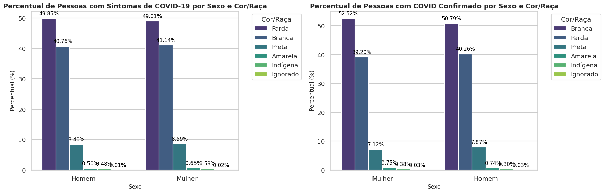
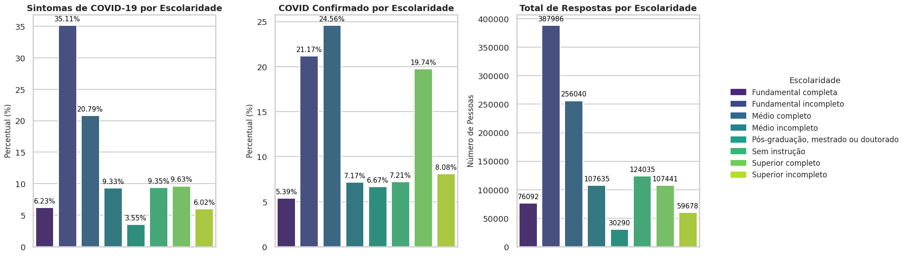
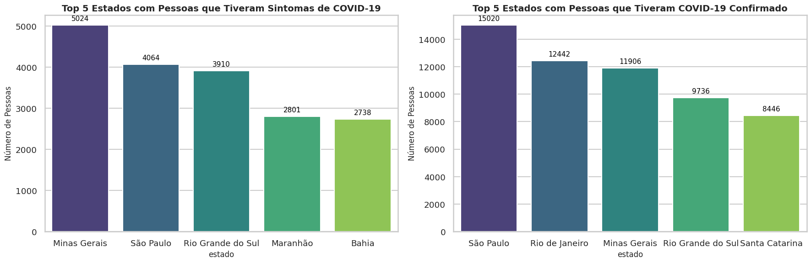
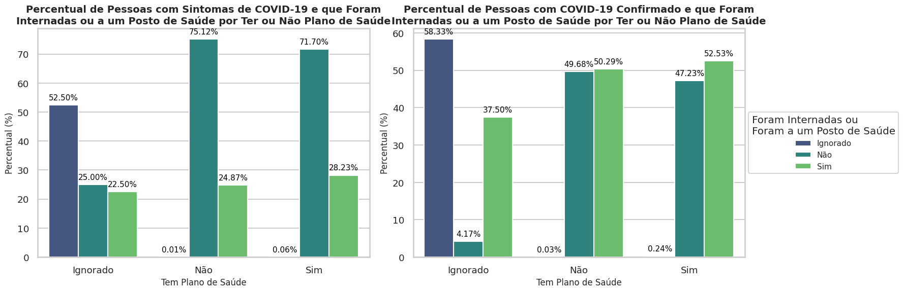
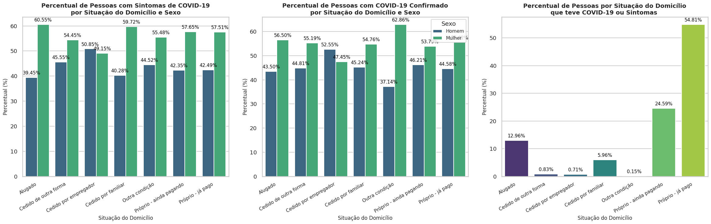
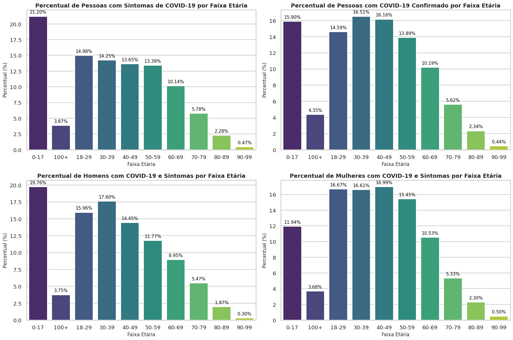
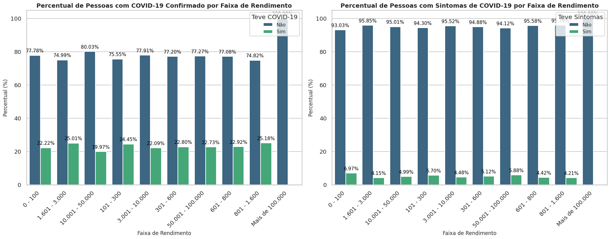
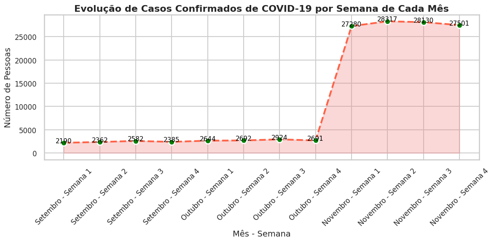

# Análise de Dados de COVID-19

Este projeto tem como objetivo realizar uma análise abrangente da incidência de sintomas e casos confirmados de COVID-19, visando entender o comportamento da população durante a pandemia. Utilizamos dados segmentados por diversos fatores, incluindo sexo, cor/raça, escolaridade, faixa etária e características econômicas.

Com base nos dados do estudo PNAD-COVID-19 do IBGE, o foco principal é identificar padrões e correlações que possam fornecer insights valiosos para a tomada de decisões em futuras situações semelhantes. Os dados analisados incluem:

- **Características clínicas dos sintomas**
- **Características da população**
- **Características econômicas da sociedade**

Além disso, este projeto considera:

1. A seleção de no máximo 20 questionamentos relevantes da pesquisa.
2. Um período de 3 meses para a construção da solução.
3. A caracterização dos sintomas clínicos da população.
4. O comportamento da população durante a pandemia.
5. A identificação de ações que o hospital deve tomar em caso de um novo surto de COVID-19.

Ao entender como diferentes grupos demográficos e sociais foram impactados pela pandemia, podemos desenvolver estratégias mais eficazes para resposta e prevenção, garantindo uma abordagem mais informada e direcionada em possíveis novos surtos.

## Organização do Projeto

No projeto, utilizamos o BigQuery como nosso banco de dados e o Apache Spark para processar e tratar os dados. O fluxo completo de execução do projeto está dividido em diferentes etapas, desde o download das bases até a geração dos gráficos finais.

### 1. Download de Bases

No notebook **"download_bases.ipynb"**, realizamos o download das bases de dados brutos e seus respectivos dicionários/dimensões. Este passo é essencial para garantir que todas as informações necessárias para as análises estejam disponíveis e organizadas.

### 2. Processamento Inicial e Upload no BigQuery - SOR

No notebook **"carregando_tabelas_no_bigquery_sor.ipynb"**, utilizamos o Spark para realizar o processamento inicial das bases. Nesse ponto, realizamos o upload das tabelas para o BigQuery na camada SOR (dados brutos e não transformados).

### 3. Tratamento dos Dados e Upload no BigQuery - SPEC

No notebook **"carregando_tabelas_no_bigquery_spec.ipynb"**, trabalhamos no tratamento das colunas, traduzindo valores e preparando os dados para análise. Utilizamos duas tabelas do dataset SOR (tbx001_data e tbx002_dimensao_geral) para criar a tabela **tbx001_data** no dataset SPEC. A tabela SPEC inclui 20 colunas selecionadas com base em sua relevância para as análises, como:

- Estado, Ano, Mês, Semana
- Sexo, Cor/Raça, Tipo de Área, Escolaridade
- Situação de Domicílio, Teve COVID, Resultado COVID
- Entre outras variáveis relevantes para a análise da pandemia.

### 4. Análises Gráficas

No notebook **"main.ipynb"**, montamos as análises gráficas que permitiram visualizar as diferentes segmentações de dados. As imagens geradas apresentam de forma clara e intuitiva os padrões que emergem dos dados, proporcionando insights que foram consolidados em uma conclusão final. Abaixo está a descrição de cada uma das análises realizadas.

---

## Gráficos e Análises

### Análise de Percentual de Pessoas com Sintomas e COVID Confirmado por Sexo e Cor/Raça

Os gráficos abaixo apresentam a distribuição percentual de pessoas que tiveram sintomas de COVID-19 e aquelas com COVID-19 confirmado, divididas por sexo e cor/raça. Esta análise ajuda a identificar possíveis grupos mais afetados pela doença, fornecendo insights importantes para políticas de saúde pública.

### Principais Observações:

**Predominância de Casos entre Pessoas Brancas e Pardas:**
- Nos dois gráficos, observamos que a maioria das pessoas que tiveram sintomas ou confirmação de COVID-19 se identificam como brancas ou pardas.
- Entre as mulheres, a distribuição é relativamente equilibrada entre essas duas categorias, enquanto entre os homens, pessoas brancas representam uma porcentagem ligeiramente maior.

**Baixa Representatividade de Outras Raças:**
- Pessoas identificadas como pretas, amarelas, indígenas e casos com raça ignorada têm percentuais significativamente menores em ambas as análises. Isso pode indicar uma menor prevalência ou subnotificação dos casos nessas populações.

**Distribuição por Sexo:**
- Para ambos os gráficos, os homens e as mulheres apresentam distribuições percentuais similares dentro de cada grupo de cor/raça.
- No entanto, para os casos confirmados (gráfico à direita), há uma leve tendência de maior percentual de pessoas brancas entre as mulheres.

---

### Análise de Distribuição por Escolaridade

Aqui, comparamos a distribuição de sintomas de COVID-19, casos confirmados e respostas totais com base no nível de escolaridade dos entrevistados. A análise mostra se existe uma correlação entre a escolaridade e o acesso à informação ou tratamento para a doença.

### Principais Observações:

**Sintomas de COVID-19 por Escolaridade:**
- A maior proporção de pessoas que relataram sintomas de COVID-19 pertence ao grupo com Fundamental Incompleto (35,11%), seguido pelo grupo com Médio Completo (20,79%).
- Os grupos de Superior Completo e Pós-graduação, mestrado ou doutorado apresentam percentuais mais baixos, abaixo de 10%.

**COVID-19 Confirmado por Escolaridade:**
- A distribuição para casos confirmados de COVID-19 é similar ao gráfico de sintomas. O grupo com Fundamental Incompleto representa 24,56% dos casos confirmados, seguido pelo grupo com Superior Completo (19,74%).

**Total de Respostas por Escolaridade:**
- O gráfico mostra a distribuição total de respostas por nível de escolaridade. A maior quantidade de respostas veio de pessoas com Fundamental Incompleto e Médio Completo. As menores participações estão entre aqueles com Médio Incompleto e Superior Incompleto.

---

### Análise dos Top 5 Estados com Pessoas que Tiveram Sintomas ou COVID-19 Confirmado

Apresentamos os cinco estados brasileiros com o maior número de pessoas que relataram sintomas de COVID-19 ou casos confirmados. Esse tipo de análise é crucial para entender as regiões mais afetadas e direcionar esforços de contenção e tratamento.

### Principais Observações:

**Sintomas de COVID-19:**
- Minas Gerais lidera com 5.024 casos reportados de pessoas que apresentaram sintomas.
- São Paulo e Rio Grande do Sul aparecem em seguida, com 4.064 e 3.910 casos, respectivamente.
- Os estados Maranhão e Bahia completam o top 5, com aproximadamente 2.800 casos cada um.

**COVID-19 Confirmado:**
- São Paulo se destaca com o maior número de casos confirmados, somando 15.020 registros.
- Rio de Janeiro e Minas Gerais ocupam a segunda e terceira posições, com 12.442 e 11.906 casos confirmados, respectivamente.
- Os estados Rio Grande do Sul e Santa Catarina fecham o top 5, com menos de 10.000 casos cada.

---

### Análise da Relação entre Plano de Saúde e Atendimento em Posto de Saúde ou Hospital para Casos de COVID-19

Aqui, analisamos a relação entre as pessoas que possuem plano de saúde e se elas buscaram atendimento em postos de saúde ou hospitais. O objetivo é entender se ter um plano de saúde impactou no comportamento de busca por atendimento médico durante a pandemia.

### Principais Observações:

**Pessoas com Sintomas de COVID-19:**
- A maioria das pessoas sem plano de saúde (75,12%) que tiveram sintomas não procuraram atendimento em postos de saúde ou hospitais.
- Pessoas com plano de saúde apresentam um comportamento semelhante, com 71,70% não procurando atendimento.

**Pessoas com COVID-19 Confirmado:**
- Entre as pessoas com COVID-19 confirmado, o grupo que possui plano de saúde tem um percentual de 52,53% que procuraram atendimento em postos de saúde ou hospitais.
- Para aqueles sem plano de saúde, o percentual de quem procurou atendimento é de 50,29%.

---

### Análise de Pessoas com Sintomas e COVID-19 Confirmado por Situação do Domicílio e Sexo

Essa análise mostra a distribuição de sintomas e casos confirmados de COVID-19 segmentados pela situação do domicílio e pelo sexo. O gráfico combinado permite observar se há uma correlação direta entre o tipo de área em que as pessoas vivem e a incidência da doença.

### Principais Observações:

**Pessoas com Sintomas de COVID-19:**
- As mulheres tiveram uma maior prevalência de sintomas em quase todas as situações de domicílio, especialmente em domicílios alugados (60,55%) e cedidos por familiar (59,72%).
- Para homens, os percentuais são ligeiramente menores, mas com destaque em próprios ainda pagando (42,35%).

**Pessoas com COVID-19 Confirmado:**
- A maior concentração de casos confirmados foi em domicílios próprios - já pago onde as mulheres representam 55%.
- A diferença entre os sexos é mais acentuada em domicílios "Outra condição", sendo as mulheres predominantes.

---

### Análise de Pessoas com Sintomas e COVID-19 Confirmado por Faixa Etária e Sexo

Analisamos a incidência de sintomas e casos confirmados de COVID-19 com base na faixa etária e sexo. Essa informação é importante para identificar quais grupos demográficos foram mais vulneráveis à infecção.

### Principais Observações:

**Faixa Etária:**
- As faixas etárias mais jovens (0-17 e 18-29 anos) apresentaram maior incidência de sintomas, enquanto as faixas de 30-49 anos foram as mais afetadas em casos confirmados de COVID-19.

**Diferença por Sexo:**
- A análise por sexo revelou que tanto homens quanto mulheres seguem uma distribuição similar em termos de sintomas e casos confirmados, porém com leve predominância de sintomas entre mulheres nas faixas de 18-39 anos e entre homens na faixa de 0-17 anos.

---

### Análise de Pessoas com Sintomas e COVID-19 Confirmado por Faixa de Rendimento

Aqui, estudamos a relação entre a renda e a incidência de sintomas e casos confirmados de COVID-19. Saber se a renda afeta a probabilidade de uma pessoa ter contraído o vírus pode ser útil para desenvolver estratégias de apoio econômico durante crises de saúde.

### Principais Observações:

**Percentual de Pessoas com COVID-19 Confirmado por Faixa de Rendimento:**
- A maior parte das pessoas em todas as faixas de rendimento não teve COVID-19 confirmado.
- As faixas de rendimento entre 0-100 e 1.601-3.000 possuem os maiores percentuais de pessoas que tiveram COVID-19 confirmado (22,22% e 25,01%, respectivamente).

**Percentual de Pessoas com Sintomas de COVID-19 por Faixa de Rendimento:**
- A maioria das pessoas em todas as faixas de rendimento não apresentou sintomas de COVID-19.
- O menor percentual de sintomas foi observado na faixa de rendimento entre 10.001-50.000 (4,15%).

---

### Evolução de Casos Confirmados de COVID-19 por Semana de Cada Mês

Esta análise acompanha a evolução dos casos confirmados de COVID-19 ao longo das semanas de cada mês. Ela permite observar o crescimento ou queda da pandemia em diferentes momentos, o que pode auxiliar na tomada de decisões para futuras pandemias.

### Principais Observações:

- Nos meses de setembro e outubro, os números de casos semanais mantiveram-se estáveis, com pequenas variações.
- A partir de novembro, observa-se um aumento expressivo no número de casos confirmados, atingindo um pico na primeira semana do mês e se mantendo elevado nas semanas seguintes.

---

### Evolução de Casos Confirmados de COVID-19 por Estado e Semana de Cada Mês (Top 5 Estados)

Neste gráfico, acompanhamos os cinco estados com o maior número de casos confirmados de COVID-19 ao longo das semanas. Essa visualização ajuda a entender como a doença se espalhou de forma diferente nas diversas regiões do país.

### Principais Observações:

- São Paulo, Rio de Janeiro e Minas Gerais são os estados que apresentam o maior número de casos confirmados ao longo do período.
- A evolução dos casos confirma uma tendência crescente em várias regiões, especialmente nas primeiras semanas do mês analisado.
- Observa-se que alguns estados, como Amazonas e Ceará, apresentam picos significativos, sugerindo surtos locais durante períodos específicos.

---

## Conclusão e Recomendações

Ao analisarmos os dados sobre a COVID-19, fica claro que precisamos agir com urgência para prevenir novos surtos. A realidade é que **49%** dos casos confirmados envolvem pessoas com baixa escolaridade, e **70%** estão na faixa etária de **18 a 59 anos**. Estados como **São Paulo** e **Minas Gerais**, que juntos representam mais de **30%** dos casos, merecem nossa atenção. É importante lembrar que muitas pessoas podem não ter buscado atendimento, o que sugere que o impacto da pandemia pode ser ainda maior do que os números indicam.

Destacamos as seguintes áreas de atuação:

- **Equidade na Saúde**: Precisamos garantir que todos tenham acesso aos serviços de saúde, incluindo testes, tratamento e vacinação, independentemente de sua situação socioeconômica.

- **Foco nos Grupos Vulneráveis**: É essencial intensificar ações de prevenção e monitoramento para grupos que mais precisam, como mulheres, pessoas com menor escolaridade e aqueles que vivem em áreas urbanas densas.

- **Campanhas de Vacinação e Educação**: A vacinação ainda é nossa principal ferramenta de combate. Vamos expandir a cobertura vacinal, especialmente entre jovens e adultos de **30 a 49 anos**, e não podemos esquecer de manter campanhas educativas sobre medidas preventivas.

- **Vigilância Epidemiológica**: Fortalecer a vigilância é crucial para detectar novos casos e variantes do vírus rapidamente. Precisamos aumentar a testagem e o rastreamento de contatos.

- **Manutenção de Medidas Preventivas**: Mesmo que os números de casos estejam caindo, é importante continuar com medidas de prevenção, como distanciamento social e higiene, especialmente em locais onde as pessoas se aglomeram.

## Recomendações para a Ação Governamental

1. **Conscientização**: Precisamos engajar os jovens e aqueles com menor escolaridade sobre a importância de reconhecer sintomas e seguir as orientações de saúde.
2. **Direcionamento de Recursos**: É crucial investir nos estados mais afetados, para fortalecer o controle de surtos e ampliar a capacidade dos hospitais.
3. **Apoio às Comunidades Vulneráveis**: Vamos garantir suporte para as comunidades que mais precisam, pois **75%** das pessoas sem plano de saúde que contraíram COVID-19 buscaram ajuda em postos de saúde.
4. **Monitoramento Ativo**: Um acompanhamento constante nas áreas onde os casos estão aumentando rapidamente é fundamental, assim podemos implementar restrições temporárias quando necessário.

Ao unirmos forças e implementarmos essas ações de forma coordenada, podemos não apenas reduzir o risco de novos surtos de COVID-19, mas também proteger a saúde de toda a população de forma mais eficaz. 

---

## GRUPO

**Grupo 57**

### INTEGRANTES DO GRUPO 57

- **Thiago dos Santos Oliveira**  
  oliveira.thiago345@hotmail.com

- **Felipe Santos Rocha**  
  sr1179281008@live.com

- **Tiago Silva Rodrigues**  
  ti_ago_silva@hotmail.com

- **Bianca Vasconcelos Silva**  
  biavasco.md@gmail.com
