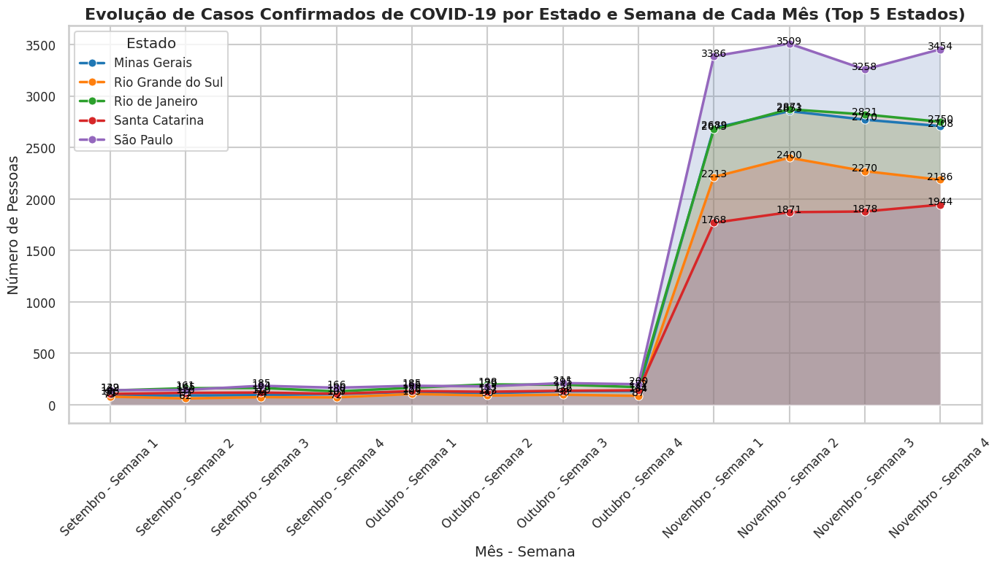

# Análise de Dados de COVID-19

Este projeto tem como objetivo realizar uma análise detalhada sobre a incidência de sintomas e casos confirmados de COVID-19, utilizando dados segmentados por diversos fatores, como sexo, cor/raça, escolaridade, faixa etária e outros. O foco principal é identificar padrões e relações que possam auxiliar na tomada de decisões sobre como lidar com futuras situações semelhantes.

## Organização do Projeto

No projeto, utilizamos o BigQuery como nosso banco de dados e o Apache Spark para processar e tratar os dados. O fluxo completo de execução do projeto está dividido em diferentes etapas, desde o download das bases até a geração dos gráficos finais.

### 1. Download de Bases

No notebook **"download_bases.ipynb"**, realizamos o download das bases de dados brutos e seus respectivos dicionários/dimensões. Este passo é essencial para garantir que todas as informações necessárias para as análises estejam disponíveis e organizadas.

### 2. Processamento Inicial e Upload no BigQuery - SOR

No notebook **"carregando_tabelas_no_bigquery_sor.ipynb"**, utilizamos o Spark para realizar o processamento inicial das bases. Nesse ponto, realizamos o upload das tabelas para o BigQuery na camada SOR (dados brutos e não transformados).

### 3. Tratamento dos Dados e Upload no BigQuery - SPEC

No notebook **"carregando_tabelas_no_bigquery_spec.ipynb"**, trabalhamos no tratamento das colunas, traduzindo valores e preparando os dados para análise. Utilizamos duas tabelas do dataset SOR (tbx001_data e tbx002_dimensao_geral) para criar a tabela **tbx001_data** no dataset SPEC. A tabela SPEC inclui 20 colunas selecionadas com base em sua relevância para as análises, como:

- Estado, Ano, Mês, Semana
- Sexo, Cor/Raça, Tipo de Área, Escolaridade
- Situação de Domicílio, Teve COVID, Resultado COVID
- Entre outras variáveis relevantes para a análise da pandemia.

### 4. Análises Gráficas

No notebook **"main.ipynb"**, montamos as análises gráficas que permitiram visualizar as diferentes segmentações de dados. As imagens geradas apresentam de forma clara e intuitiva os padrões que emergem dos dados, proporcionando insights que foram consolidados em uma conclusão final. Abaixo está a descrição de cada uma das análises realizadas.

---

## Gráficos e Análises

### Análise de Percentual de Pessoas com Sintomas e COVID Confirmado por Sexo e Cor/Raça

Os gráficos abaixo apresentam a distribuição percentual de pessoas que tiveram sintomas de COVID-19 e aquelas com COVID-19 confirmado, divididas por sexo e cor/raça. Esta análise ajuda a identificar possíveis grupos mais afetados pela doença, fornecendo insights importantes para políticas de saúde pública.

---

### Análise de Distribuição por Escolaridade

Aqui, comparamos a distribuição de sintomas de COVID-19, casos confirmados e respostas totais com base no nível de escolaridade dos entrevistados. A análise mostra se existe uma correlação entre a escolaridade e o acesso à informação ou tratamento para a doença.

---

### Análise dos Top 5 Estados com Pessoas que Tiveram Sintomas ou COVID-19 Confirmado

Apresentamos os cinco estados brasileiros com o maior número de pessoas que relataram sintomas de COVID-19 ou casos confirmados. Esse tipo de análise é crucial para entender as regiões mais afetadas e direcionar esforços de contenção e tratamento.

---

### Análise da Relação entre Plano de Saúde e Atendimento em Posto de Saúde ou Hospital para Casos de COVID-19

Aqui, analisamos a relação entre as pessoas que possuem plano de saúde e se elas buscaram atendimento em postos de saúde ou hospitais. O objetivo é entender se ter um plano de saúde impactou no comportamento de busca por atendimento médico durante a pandemia.

---

### Análise de Pessoas com Sintomas e COVID-19 Confirmado por Situação do Domicílio e Sexo

Essa análise mostra a distribuição de sintomas e casos confirmados de COVID-19 segmentados pela situação do domicílio (urbano/rural) e pelo sexo. O gráfico combinado permite observar se há uma correlação direta entre o tipo de área em que as pessoas vivem e a incidência da doença.

---

### Análise de Pessoas com Sintomas e COVID-19 Confirmado por Faixa Etária e Sexo

Analisamos a incidência de sintomas e casos confirmados de COVID-19 com base na faixa etária e sexo. Essa informação é importante para identificar quais grupos demográficos foram mais vulneráveis à infecção.

---

### Análise de Pessoas com Sintomas e COVID-19 Confirmado por Faixa de Rendimento

Aqui, estudamos a relação entre a renda e a incidência de sintomas e casos confirmados de COVID-19. Saber se a renda afeta a probabilidade de uma pessoa ter contraído o vírus pode ser útil para desenvolver estratégias de apoio econômico durante crises de saúde.

---

### Evolução de Casos Confirmados de COVID-19 por Semana de Cada Mês

Esta análise acompanha a evolução dos casos confirmados de COVID-19 ao longo das semanas de cada mês. Ela permite observar o crescimento ou queda da pandemia em diferentes momentos, o que pode auxiliar na tomada de decisões para futuras pandemias.

---

### Evolução de Casos Confirmados de COVID-19 por Estado e Semana de Cada Mês (Top 5 Estados)

Neste gráfico, acompanhamos os cinco estados com o maior número de casos confirmados de COVID-19 ao longo das semanas. Essa visualização ajuda a entender como a doença se espalhou de forma diferente nas diversas regiões do país.

---

## Conclusão

